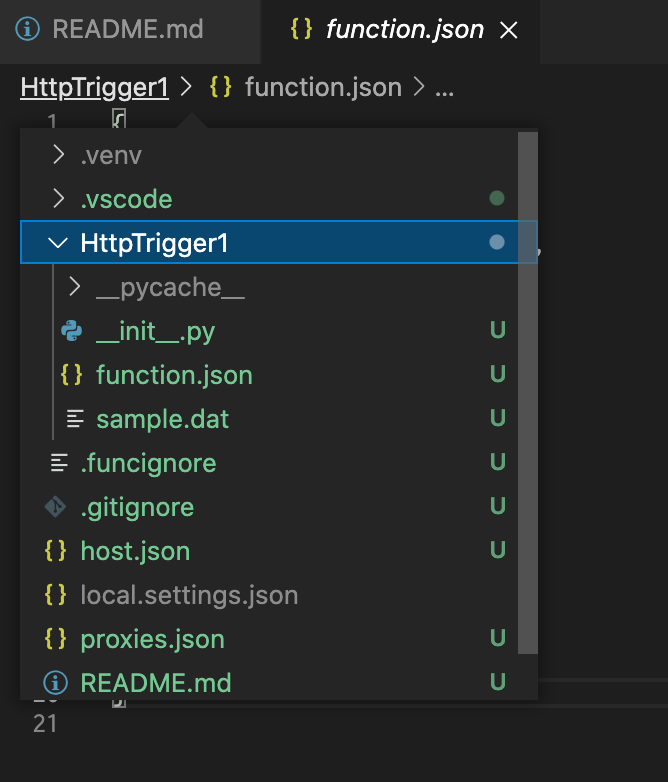

### Azure-Functions

* Azure portal
    https://portal.azure.com/

* 関数の編集方法


### memo
* "Python extension loading" forever.
* I have to downgrade to the previous version because of this.
    * →2020年10月ぐらいのに変更した
* There seems to be many duplicates of this in the last few hours #14976
    * https://github.com/microsoft/vscode-python/issues/14975
* 前のバージョンのインストール方法
    * https://code.visualstudio.com/updates/v1_30#_install-previous-versions

### Azureでの構成
* 関数アプリ
    * 関数アプリを作成(選択)
        * 関数
            * 関数名を選択 // HttpTrigger1 とかそんな名前
                * コードとテスト
                * 統合
                * モニター
                * 関数キー

### ローカルでの開発
* VScode

```
npm install -g azure-functions-core-tools@3 --unsafe-perm true
```

* Azure Functions プロジェクトを作成する
    * [新しいプロジェクトの作成] アイコンを [Azure:関数] パネルでクリック
* 関数を作成する
    * [関数の作成] アイコンを [Azure:関数] パネルでクリック
    * 作業の開始用として、HTTP トリガー選択
* 関数プロジェクトをローカルで実行する
    * 関数アプリを実行するには、F5 キーを押下
    * HTTP 関数の URL が出力されるのでこれをブラウザーにコピーして実行
    * デバッグを停止するには、Shift キーを押しながら F5 キー を押下
* コードを Azure にデプロイする
    * (Function App へのデプロイ) アイコンを [Azure:関数] パネルでクリック
    * 関数アプリの選択を求めるメッセージが表示されたら、関数アプリをプロジェクトを選択

### 所感
* API-Gateway的な機能も備わっているよう
* HTTPトリガーで呼び出すことが可能 // AWS-Lambdaは直接HTTPを受けられない
* 作成方法
    * コンソールログイン用URL
        * https://portal.azure.com/
        * ログインしてリソースの作成を選択
        * 「関数アプリ」を選択
        * 必要事項記入
* POSTリクエストの方法
    * function.json にトリガー、許容リクエスト等を記載 //API-Gatewayのよう
* vscodeのエクステンションを使用
    * Azure Functions
        * Extension Id: ms-azuretools.vscode-azurefunctions
    * Azure Account
        * Extension Id: ms-vscode.azure-account
* Functionsで使うクラス
    * HttpRequest class
        * https://docs.microsoft.com/ja-jp/python/api/azure-functions/azure.functions.httprequest?view=azure-python
* LINE messaging API(応答メッセージ)
    * https://developers.line.biz/ja/reference/messaging-api/#send-reply-message


OpenAPI2.0

